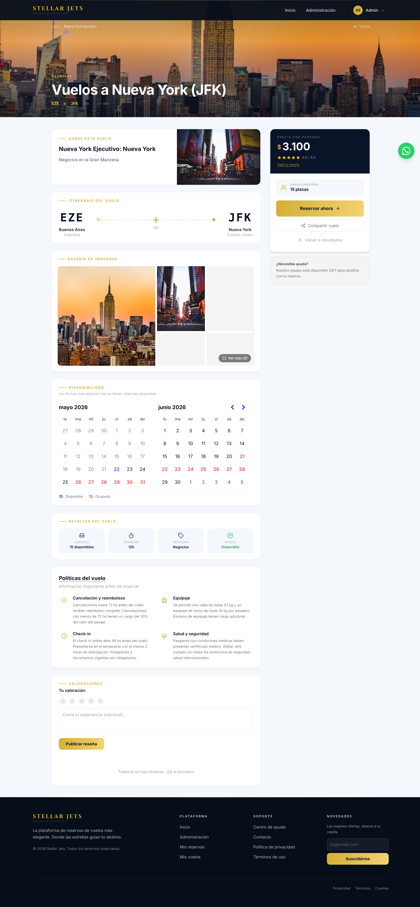
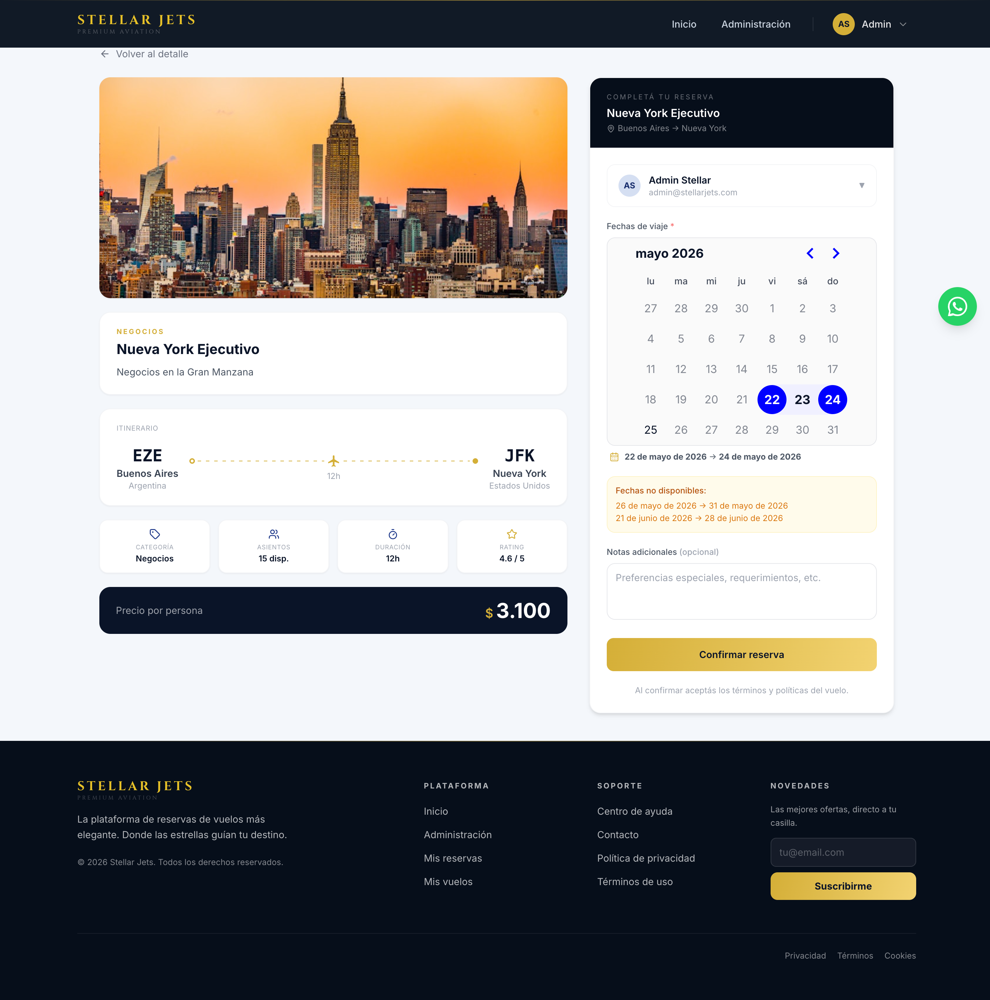
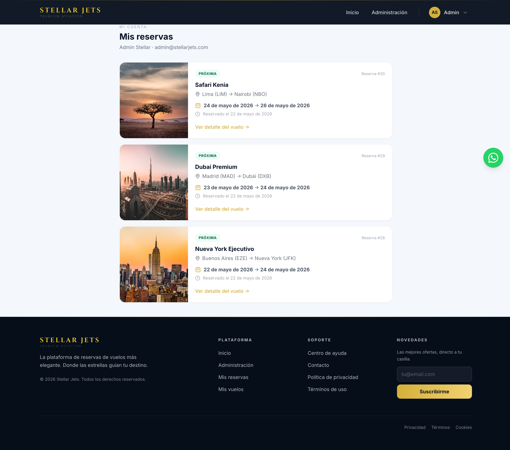
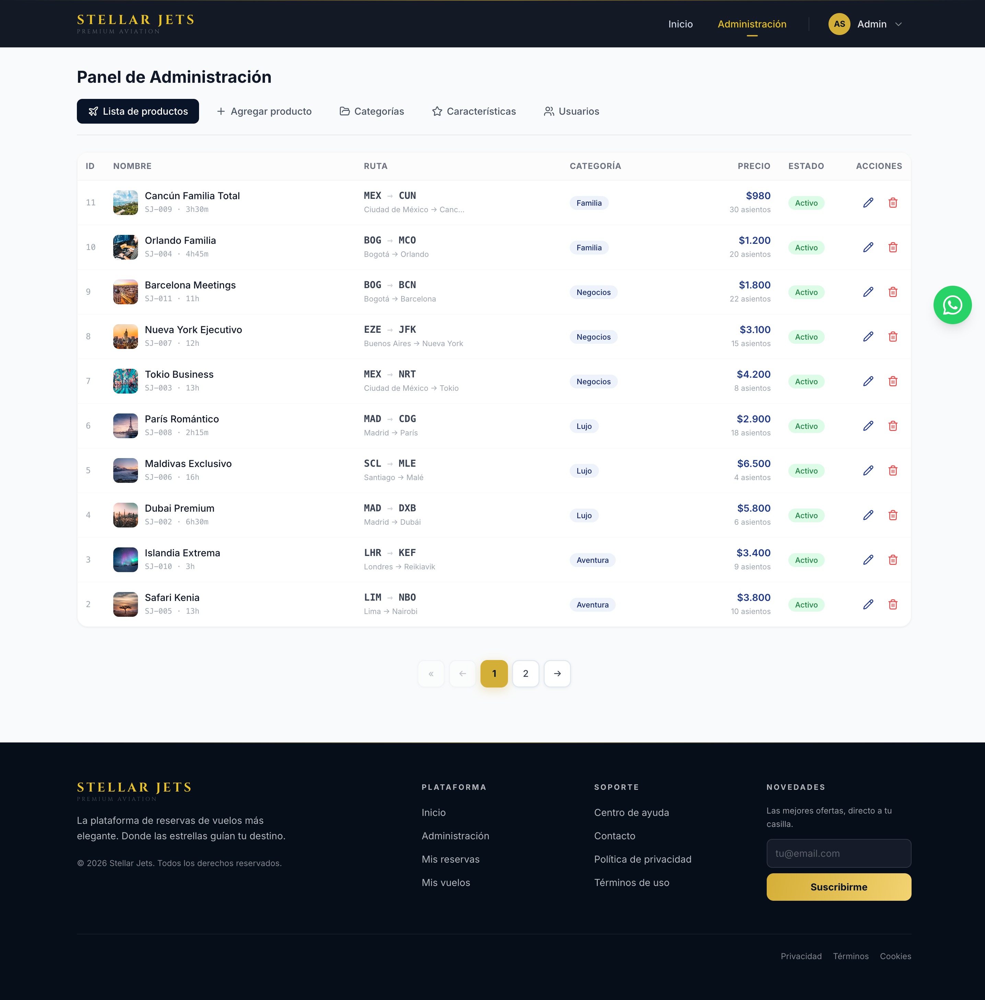

# ✈️ Stellar Jets

Plataforma web de reservas de vuelos premium. Permite a los usuarios registrarse, explorar destinos, visualizar galerías de imágenes, filtrar por categoría y realizar reservas. Los administradores gestionan el catálogo completo de vuelos, categorías y características desde un panel dedicado.

> *Donde las estrellas guían tu destino* · Desafío Profesional · Digital House · 2026

---

## 🌐 Deploy

| | URL |
|---|---|
| **Frontend** | https://stellarjets.netlify.app |
| **Backend / API** | https://flight-booking-platform-spring-react.onrender.com |
| **Swagger UI** | https://flight-booking-platform-spring-react.onrender.com/swagger-ui.html |

---

## 🖼️ Screenshots

| Home | Home (Admin) |
|------|-------------|
|  |  |

| Detalle de vuelo | Nueva reserva |
|-----------------|--------------|
|  |  |

| Mis reservas | Panel de administración |
|-------------|------------------------|
|  |  |

---

## ⚙️ Tecnologías

### 🖥️ Frontend
- React 18 + TypeScript
- Vite 5
- Tailwind CSS 3
- React Router v6
- Axios
- Lucide React (iconografía)
- react-day-picker 10 (calendario de fechas)

### ☕ Backend
- Java 21
- Spring Boot 3.3.5
- Spring Security 6 + JWT (JJWT 0.12.6)
- Spring Data JPA + Hibernate
- H2 Database (in-memory)
- Spring Mail (Mailtrap sandbox)
- Lombok 1.18.38
- Maven 3.8+

### 🧪 Testing
- JUnit 5 + MockMvc (tests de integración API)
- Selenium 4 + WebDriverManager (tests UI end-to-end)
- Allure (reportes visuales)
- Page Object Model

---

## 🚀 Instalación local

### 🧩 Requisitos previos
- Java 21+
- Node.js 18+
- Maven 3.8+

### 📦 Clonar el repositorio
```bash
git clone https://github.com/JoshuaSMC/flight-booking-platform-spring-react.git
cd flight-booking-platform-spring-react
```

---

### ☕ Backend (`/stellar-jets-backend`)

> La base de datos H2 es **in-memory**: se crea automáticamente al iniciar con 11 vuelos, 4 categorías, 8 características y 2 usuarios de prueba. No requiere instalar ni configurar ninguna base de datos.

#### Variables de entorno (opcionales — solo para notificación por email):

```bash
cp .env.example .env
# Editá .env con tus credenciales de Mailtrap
```

El archivo `.env.example` incluido en el repo muestra las variables requeridas:

```
MAIL_USERNAME=<tu_mailtrap_user>
MAIL_PASSWORD=<tu_mailtrap_pass>
```

#### Correr el backend:
```bash
cd stellar-jets-backend

# Sin email:
mvn spring-boot:run

# Con notificación por email (Mailtrap):
MAIL_USERNAME=<user> MAIL_PASSWORD=<pass> mvn spring-boot:run
```

> El backend estará disponible en `http://localhost:8080`  
> Swagger UI disponible en `http://localhost:8080/swagger-ui.html`  
> Consola H2 disponible en `http://localhost:8080/h2-console` — JDBC URL: `jdbc:h2:mem:stellarjets` · Usuario: `sa` · Sin contraseña

---

### 🖼️ Frontend (`/stellar-jets-frontend`)

```bash
cd stellar-jets-frontend
npm install
npm run dev
```

> La aplicación estará disponible en `http://localhost:5173`

No se requiere archivo `.env`. El frontend usa el proxy de Vite para redirigir `/api/*` → `http://localhost:8080`.

---

## 📬 Endpoints (API REST)

> Swagger Docs disponible en: `http://localhost:8080/swagger-ui.html`

### Públicos

| Método | Endpoint | Descripción | Auth |
|--------|----------|-------------|------|
| POST | `/api/auth/register` | Registro de usuario → JWT | ❌ |
| POST | `/api/auth/login` | Login → JWT | ❌ |
| POST | `/api/auth/resend-confirmation` | Reenviar email de confirmación | ❌ |
| GET | `/api/flights/search` | Vuelos paginados con búsqueda y filtro por categoría | ❌ |
| GET | `/api/flights/recommended` | Top 10 vuelos por rating | ❌ |
| GET | `/api/flights/{id}` | Detalle de vuelo con características | ❌ |
| GET | `/api/categories` | Listado de categorías | ❌ |
| GET | `/api/categories/active` | Categorías activas con imagen y conteo de vuelos | ❌ |
| GET | `/api/characteristics` | Listado de características | ❌ |
| GET | `/api/reviews/{flightId}` | Reseñas de un vuelo | ❌ |
| GET | `/api/reservations/{flightId}/occupied-dates` | Fechas ocupadas de un vuelo | ❌ |

### Protegidos — Rol USER

| Método | Endpoint | Descripción | Auth |
|--------|----------|-------------|------|
| POST | `/api/reservations/{flightId}` | Crear reserva con checkIn y checkOut | ✅ USER |
| GET | `/api/reservations/my` | Historial de reservas del usuario | ✅ USER |
| POST | `/api/favorites/{flightId}` | Agregar vuelo a favoritos | ✅ USER |
| DELETE | `/api/favorites/{flightId}` | Quitar vuelo de favoritos | ✅ USER |
| GET | `/api/favorites` | Listado de vuelos favoritos del usuario | ✅ USER |
| POST | `/api/reviews/{flightId}` | Crear o actualizar reseña de un vuelo | ✅ USER |

### Protegidos — Rol ADMIN

| Método | Endpoint | Descripción | Auth |
|--------|----------|-------------|------|
| GET / POST | `/api/admin/flights` | Listar / crear vuelo | ✅ ADMIN |
| PUT / DELETE | `/api/admin/flights/{id}` | Editar / eliminar vuelo | ✅ ADMIN |
| PATCH | `/api/admin/flights/{id}/toggle` | Activar / desactivar vuelo | ✅ ADMIN |
| POST / PUT / DELETE | `/api/admin/categories/{id?}` | CRUD categorías | ✅ ADMIN |
| POST / PUT / DELETE | `/api/admin/characteristics/{id?}` | CRUD características | ✅ ADMIN |
| GET | `/api/admin/users` | Listar usuarios | ✅ ADMIN |
| PATCH | `/api/admin/users/{id}/toggle-role` | Cambiar rol USER ↔ ADMIN | ✅ ADMIN |

---

## 📖 Documentación de la API (Swagger / OpenAPI)

La API está documentada con **springdoc-openapi 2.6.0** (estándar para Spring Boot 3.x en 2026).

Una vez levantado el backend, accedé a:

```
http://localhost:8080/swagger-ui.html
```

Desde Swagger UI podés:
- Ver todos los endpoints con sus parámetros y respuestas
- Probar endpoints públicos directamente desde el navegador
- Autenticarte con JWT para probar endpoints protegidos:
  1. Ejecutar `POST /api/auth/login` con las credenciales de admin
  2. Copiar el token de la respuesta
  3. Hacer clic en el botón **Authorize** 🔒 (arriba a la derecha)
  4. Pegar el token y confirmar
  5. Todos los endpoints admin quedan habilitados en la sesión

---

## 🗂️ Diagrama de Entidades

```
┌─────────────────────────────────────────┐       ┌───────────────────────────┐
│                 Flight                  │       │           User            │
├─────────────────────────────────────────┤       ├───────────────────────────┤
│ id              bigint (PK)             │       │ id         bigint (PK)    │
│ flightNumber    varchar                 │       │ firstName  varchar        │
│ name            varchar (único)         │       │ lastName   varchar        │
│ description     text                    │       │ email      varchar (único)│
│ price           decimal                 │       │ password   varchar BCrypt │
│ availableSeats  int                     │       │ role       USER / ADMIN   │
│ durationMinutes integer                 │       │ active     boolean        │
│ rating          decimal                 │       └───────────────────────────┘
│ reviewCount     int                     │                │ 1          │ 1
│ active          boolean                 │                │            │
│ origin_*        @Embeddable AirportInfo │                │            │
│ dest_*          @Embeddable AirportInfo │                │            │
│ category_id     bigint (FK → Category)  │                │            │
└─────────────────────────────────────────┘                ▼ N          ▼ N
       │ 1         │ 1         │ N         │ N    ┌─────────────┐ ┌──────────┐
       │           │           │           │      │  Favorite   │ │  Review  │
       ▼ N         ▼ N         ▼ N         ▼ N    ├─────────────┤ ├──────────┤
┌──────────┐ ┌──────────────┐ ┌──────────────┐   │ id (PK)     │ │ id (PK)  │
│ Category │ │ FlightImage  │ │Characteristic│   │ user_id(FK) │ │ user_id  │
├──────────┤ ├──────────────┤ ├──────────────┤   │ flight_id   │ │ flight_id│
│ id (PK)  │ │ id (PK)      │ │ id (PK)      │   │   (FK)      │ │   (FK)   │
│ name     │ │ url          │ │ name         │   │ createdAt   │ │ stars    │
│ imageUrl │ │ cover bool   │ │ iconName     │   └─────────────┘ │ comment  │
│ desc     │ └──────────────┘ └──────────────┘                   │createdAt │
└──────────┘                                                      └──────────┘

┌─────────────────────────────────────────┐
│               Reservation               │
├─────────────────────────────────────────┤
│ id          bigint (PK)                 │
│ userEmail   varchar                     │
│ checkIn     date                        │
│ checkOut    date                        │
│ createdAt   datetime                    │
│ flight_id   bigint (FK → Flight)        │
└─────────────────────────────────────────┘
```

---

## 🧪 Testing

### Estrategia

| Tipo | Herramienta | Requiere servidores |
|------|-------------|---------------------|
| 🤖 API / Integración | JUnit 5 + MockMvc + H2 | No — solo Maven |
| 🌐 UI / End-to-end | Selenium + WebDriverManager | Sí — backend + frontend |
| 👁 Manual | Navegador | Sí |

### Archivos de test

| Archivo | Tipo | Tests |
|---------|------|-------|
| `Sprint1ControllerTest.java` | API | 18 — US#3 al US#11 |
| `Sprint2ControllerTest.java` | API | 28 — US#12 al US#21 |
| `Sprint3ControllerTest.java` | API | 26 — US#22 al US#29 |
| `Sprint4ControllerTest.java` | API | 19 — US#30 al US#33 |
| `Sprint1UITest.java` | UI Selenium | 20 — US#1 al US#11 |
| `Sprint2UITest.java` | UI Selenium | 22 — US#12 al US#21 |
| `Sprint3UITest.java` | UI Selenium | 23 — US#22 al US#29 |
| `Sprint4UITest.java` | UI Selenium | 25 — US#30 al US#35 |

**Page Object Model** — cada página tiene su clase en `ui/pages/`:
`BasePage` · `HomePage` · `LoginPage` · `RegisterPage` · `FlightDetailPage` · `AdminPanelPage` · `ReservationPage` · `MyReservationsPage`

**Usuarios de prueba** (creados automáticamente):

| Email | Password | Rol |
|-------|----------|-----|
| `admin@stellarjets.com` | `admin123` | ADMIN |
| `user@stellarjets.com` | `user123` | USER |

### Cómo ejecutar

**Tests de API** (sin servidores):
```bash
cd stellar-jets-backend
mvn test -Dtest="Sprint1ControllerTest,Sprint2ControllerTest,Sprint3ControllerTest,Sprint4ControllerTest"
```

**Tests de UI con Selenium** (3 terminales):

> Los tests de UI se ejecutan por separado por sprint para garantizar el aislamiento entre suites y evitar interferencias de carga en el backend.

```bash
# Terminal 1 — backend (con variables de entorno para email):
cd stellar-jets-backend
./run-dev.sh

# Terminal 2 — frontend:
cd stellar-jets-frontend
npm run dev

# Terminal 3 — tests UI (ejecutar uno por vez):
cd stellar-jets-backend
mvn test -Dtest="Sprint1UITest"
mvn test -Dtest="Sprint2UITest"
mvn test -Dtest="Sprint3UITest"
mvn test -Dtest="Sprint4UITest"
```

**Todos los tests:**
```bash
cd stellar-jets-backend
mvn test
```

**Reporte visual Allure:**
```bash
cd stellar-jets-backend
mvn allure:serve -Dallure.serve.port=5050
# Abre automáticamente http://localhost:5050
```

> No abrir `index.html` directamente con `file://` — el reporte queda en "loading". Usar siempre `allure:serve`.

### Resultados

| Suite | API | UI Selenium | Manual | Total |
|-------|-----|-------------|--------|-------|
| Sprint 1 | 18 ✅ | 20 ✅ | 12 ✅ | **50 / 50** |
| Sprint 2 | 28 ✅ | 22 ✅ | 12 ✅ | **62 / 62** |
| Sprint 3 | 26 ✅ | 23 ✅ | 16 ✅ | **65 / 65** |
| Sprint 4 | 19 ✅ | 25 ✅ | 8 ✅ | **52 / 52** |

---

## 📋 Entregables del curso

### Sprint 1

#### Entregable 01 — Documentación / Bitácora

**Definición del proyecto:**
**Stellar Jets** es una plataforma web de reservas de vuelos premium. Centraliza la búsqueda y reserva de vuelos en una interfaz moderna, inspirada en aerolíneas de lujo. Los usuarios exploran destinos, visualizan galerías de imágenes, filtran por categoría y realizan reservas. Los administradores gestionan el catálogo completo desde un panel dedicado.

**Rol: Scrum Master**

| Ítem | Detalle |
|------|---------|
| **Metodología** | Scrum — iteraciones por sprint |
| **Sprint** | Sprint 1 |
| **Meta del sprint** | Header · Home · Detalle de producto · Galería · Panel admin · Paginación |
| **Equipo** | Full-stack (Frontend · Backend · BBDD · Infra · UX/UI · QA) |
| **Herramientas** | GitHub · Maven · Vite |

**Bitácora:**

| Iteración | Actividad | Estado |
|-----------|-----------|--------|
| 1 | Estructura base (Spring Boot + React + Vite) | ✅ |
| 2 | Header fijo con logo y botones de navegación | ✅ |
| 3 | Home page con buscador, categorías y recomendados | ✅ |
| 4 | Entidad `Flight` con `AirportInfo` y `FlightImage` | ✅ |
| 5 | CRUD de vuelos desde el panel admin | ✅ |
| 6 | Página de detalle con header hero | ✅ |
| 7 | Galería de imágenes con lightbox | ✅ |
| 8 | Footer con isologotipo y copyright | ✅ |
| 9 | Paginación con metadatos | ✅ |
| 10 | Búsqueda por nombre, ciudad o código IATA | ✅ |
| 11 | Toggle activo/inactivo y eliminación de vuelos | ✅ |

**US completadas:** US#1 · US#2 · US#3 · US#4 · US#5 · US#6 · US#7 · US#8 · US#9 · US#10 · US#11 ✅

#### Entregable 02 — Identidad de Marca

**Logo:**
```
     STELLAR JETS
     PREMIUM AVIATION
```
- Tipografía: Cinzel 700 — serif romana uppercase
- Color: Dorado `#D4AF37` sobre navy `#0A1428`
- Slogan: *Donde las estrellas guían tu destino*

**Paleta de colores:**

| Nombre | Hex | Uso |
|--------|-----|-----|
| Navy Principal | `#0A1428` | Header, footer, fondos oscuros |
| Navy Profundo | `#060E1A` | Footer background |
| Dorado Principal | `#D4AF37` | Logo, botones primarios, acentos |
| Dorado Claro | `#F5D576` | Hover states |
| Fondo Claro | `#F4F7FB` | Background del sitio |
| Blanco | `#FFFFFF` | Texto sobre fondos oscuros |
| Gris Texto | `#64748B` | Textos secundarios |

**Tipografías:**

| Rol | Familia | Peso |
|-----|---------|------|
| Display | Cinzel | 700 |
| Cuerpo | Inter | 300–700 |

#### Entregable 03 — Planificación y Ejecución de Tests

Ver sección [🧪 Testing](#-testing) para la estrategia, comandos de ejecución y resultados.

**Casos de prueba Sprint 1:**

| # | Tipo | US | Caso de prueba | Estado |
|---|------|----|---------------|--------|
| TC-S1-01 | 🤖 API | US#3 | Crear producto con nombre único → HTTP 201 | ✅ |
| TC-S1-02 | 🤖 API | US#3 | Nombre duplicado → HTTP 409 | ✅ |
| TC-S1-03 | 🤖 API | US#3 | Código de vuelo duplicado → HTTP 409 | ✅ |
| TC-S1-04 | 🤖 API | US#3 | Subir múltiples imágenes → array de 3 | ✅ |
| TC-S1-05 | 🤖 API | US#4 | Paginación máximo 10 productos | ✅ |
| TC-S1-06 | 🤖 API | US#4 | Búsqueda por nombre filtra correctamente | ✅ |
| TC-S1-07 | 🤖 API | US#5 | API devuelve nombre, descripción e imágenes | ✅ |
| TC-S1-08 | 🤖 API | US#6 | API devuelve 5 imágenes | ✅ |
| TC-S1-09 | 🤖 API | US#6 | Primera imagen marcada como cover | ✅ |
| TC-S1-10 | 🤖 API | US#8 | Metadatos de paginación presentes | ✅ |
| TC-S1-11 | 🤖 API | US#8 | Paginación con filtro de categoría | ✅ |
| TC-S1-12 | 🤖 API | US#9 | Endpoint admin accesible → HTTP 200 | ✅ |
| TC-S1-13 | 🤖 API | US#9 | Toggle activo/inactivo cambia estado | ✅ |
| TC-S1-14 | 🤖 API | US#9 | Editar producto actualiza datos | ✅ |
| TC-S1-15 | 🤖 API | US#10 | Listado admin paginado con id y nombre | ✅ |
| TC-S1-16 | 🤖 API | US#10 | Producto creado aparece en listado admin | ✅ |
| TC-S1-17 | 🤖 API | US#11 | Eliminar producto → 204 · GET posterior → 404 | ✅ |
| TC-S1-18 | 🤖 API | US#11 | Eliminar producto inexistente → 404 | ✅ |
| TC-UI-S1-01 | 🌐 Selenium | US#1 | Header visible en la página principal | ✅ |
| TC-UI-S1-02 | 🌐 Selenium | US#1 | Logo "STELLAR JETS" presente en el header | ✅ |
| TC-UI-S1-03 | 🌐 Selenium | US#1 | Botones "Crear cuenta" e "Iniciar sesión" | ✅ |
| TC-UI-S1-04 | 🌐 Selenium | US#1 | Clic en logo redirige al home | ✅ |
| TC-UI-S1-05 | 🌐 Selenium | US#1 | Header fijo al hacer scroll | ✅ |
| TC-UI-S1-06 | 🌐 Selenium | US#2 | Sección buscador visible en el home | ✅ |
| TC-UI-S1-07 | 🌐 Selenium | US#2 | Sección recomendados visible | ✅ |
| TC-UI-S1-08 | 🌐 Selenium | US#4 | Productos visibles en el home | ✅ |
| TC-UI-S1-09 | 🌐 Selenium | US#5 | Página de detalle carga correctamente | ✅ |
| TC-UI-S1-10 | 🌐 Selenium | US#5 | Header hero ocupa el ancho completo | ✅ |
| TC-UI-S1-11 | 🌐 Selenium | US#5 | Botón "Volver" presente en el detalle | ✅ |
| TC-UI-S1-12 | 🌐 Selenium | US#6 | Imágenes visibles en el detalle | ✅ |
| TC-UI-S1-13 | 🌐 Selenium | US#6 | Botón "Ver más" presente | ✅ |
| TC-UI-S1-14 | 🌐 Selenium | US#6 | Clic en "Ver más" abre lightbox | ✅ |
| TC-UI-S1-15 | 🌐 Selenium | US#7 | Footer visible en el home | ✅ |
| TC-UI-S1-16 | 🌐 Selenium | US#7 | Footer contiene logo, año y copyright | ✅ |
| TC-UI-S1-17 | 🌐 Selenium | US#7 | Footer visible en página de detalle | ✅ |
| TC-UI-S1-18 | 🌐 Selenium | US#9 | URL `/administracion` accesible | ✅ |
| TC-UI-S1-19 | 🌐 Selenium | US#9 | Botón "Lista de productos" presente | ✅ |
| TC-UI-S1-20 | 🌐 Selenium | US#9 | Botón "Agregar producto" presente | ✅ |
| TC-MAN-S1-01 | 👁 Manual | US#2 | Background acorde a identidad de marca | ✅ |
| TC-MAN-S1-02 | 👁 Manual | US#2 | Responsividad del home | ✅ |
| TC-MAN-S1-03 | 👁 Manual | US#4 | Distribución 2 columnas × 5 filas | ✅ |
| TC-MAN-S1-04 | 👁 Manual | US#5 | Título alineado a la izquierda | ✅ |
| TC-MAN-S1-05 | 👁 Manual | US#6 | Layout desktop: imagen izq + grid 2×2 der | ✅ |
| TC-MAN-S1-06 | 👁 Manual | US#6 | Galería responsive en mobile/tablet | ✅ |
| TC-MAN-S1-07 | 👁 Manual | US#7 | Responsividad del footer | ✅ |
| TC-MAN-S1-08 | 👁 Manual | US#8 | Botones Inicio · Anterior · Siguiente | ✅ |
| TC-MAN-S1-09 | 👁 Manual | US#9 | Panel no disponible en mobile | ✅ |
| TC-MAN-S1-10 | 👁 Manual | US#10 | Columnas Id, Nombre, Acciones visibles | ✅ |
| TC-MAN-S1-11 | 👁 Manual | US#11 | Modal de confirmación al presionar Eliminar | ✅ |
| TC-MAN-S1-12 | 👁 Manual | US#11 | Cancelar eliminación — sin cambios | ✅ |

---

### Sprint 2

#### Entregable 01 — Documentación / Bitácora

**Definición del proyecto:**
Continuación del Sprint 1. El alcance del Sprint 2 agrega autenticación completa con JWT (registro, login, logout, roles), gestión de características por vuelo con íconos Lucide, sección de categorías con imágenes, filtro multi-categoría y notificación por email al registrarse.

**Rol: Scrum Master**

| Ítem | Detalle |
|------|---------|
| **Metodología** | Scrum — iteraciones por sprint |
| **Sprint** | Sprint 2 |
| **Meta del sprint** | Autenticación JWT · Características · Categorías con imagen · Notificación email |
| **Equipo** | Full-stack (Frontend · Backend · BBDD · Infra · UX/UI · QA) |
| **Herramientas** | GitHub · Maven · Vite · Spring Security · Mailtrap (sandbox SMTP) |

**Bitácora:**

| Iteración | Actividad | Estado |
|-----------|-----------|--------|
| 1 | Spring Security + JWT stateless | ✅ |
| 2 | Endpoints `/api/auth/register` y `/api/auth/login` | ✅ |
| 3 | Entidad `User` con roles USER / ADMIN, BCrypt | ✅ |
| 4 | Página de registro con validación (solo letras en nombre) | ✅ |
| 5 | Página de login con persistencia de sesión | ✅ |
| 6 | Logout — limpieza del token JWT en localStorage | ✅ |
| 7 | Protección de rutas admin con rol ADMIN | ✅ |
| 8 | CRUD de características con ícono Lucide | ✅ |
| 9 | Asociación características ↔ vuelos desde admin | ✅ |
| 10 | Componente `CharIcon` compartido | ✅ |
| 11 | Notificación por email (`@Async`, Mailtrap sandbox) | ✅ |
| 12 | Pantalla post-registro con reenvío de confirmación | ✅ |
| 13 | Tarjetas de categorías con imagen en el home | ✅ |
| 14 | Filtro multi-categoría con selección visual | ✅ |
| 15 | CRUD de categorías con URL de imagen desde admin | ✅ |

**US completadas:** US#12 · US#13 · US#14 · US#15 · US#16 · US#17 · US#18 · US#19 · US#20 · US#21 ✅

#### Entregable 02 — Planificación y Ejecución de Tests

Ver sección [🧪 Testing](#-testing) para la estrategia, comandos de ejecución y resultados.

**Casos de prueba Sprint 2:**

| # | Tipo | US | Caso de prueba | Estado |
|---|------|----|---------------|--------|
| TC-S2-01 | 🤖 API | US#12 | Registrar usuario con datos válidos: devuelve 201 + token JWT | ✅ |
| TC-S2-02 | 🤖 API | US#12 | Email ya registrado: devuelve 409 | ✅ |
| TC-S2-03 | 🤖 API | US#12 | Campos obligatorios vacíos: devuelve 400 | ✅ |
| TC-S2-04 | 🤖 API | US#12 | Contraseña menor a 6 caracteres: devuelve 400 | ✅ |
| TC-S2-05 | 🤖 API | US#13 | Login con credenciales correctas: devuelve 200 + token | ✅ |
| TC-S2-06 | 🤖 API | US#13 | Login con contraseña incorrecta: devuelve 401 | ✅ |
| TC-S2-07 | 🤖 API | US#13 | Login con email inexistente: devuelve 401 | ✅ |
| TC-S2-08 | 🤖 API | US#14 | Token incluye firstName, lastName, email y role | ✅ |
| TC-S2-09 | 🤖 API | US#16 | Endpoint admin /api/admin/users responde 200 | ✅ |
| TC-S2-10 | 🤖 API | US#16 | Usuario registrado aparece en listado admin con rol USER | ✅ |
| TC-S2-11 | 🤖 API | US#16 | Toggle de rol USER → ADMIN funciona correctamente | ✅ |
| TC-S2-12 | 🤖 API | US#17 | Crear característica: devuelve 201 con id, name e iconName | ✅ |
| TC-S2-13 | 🤖 API | US#17 | Listar características: devuelve 200 con array | ✅ |
| TC-S2-14 | 🤖 API | US#17 | Editar característica: actualiza nombre e ícono | ✅ |
| TC-S2-15 | 🤖 API | US#17 | Eliminar característica: devuelve 204 | ✅ |
| TC-S2-16 | 🤖 API | US#18 | Detalle de vuelo incluye campo characteristics | ✅ |
| TC-S2-17 | 🤖 API | US#18 | Características de vuelo incluyen name e iconName | ✅ |
| TC-S2-18 | 🤖 API | US#19 | Registro exitoso aunque email service falle (async) | ✅ |
| TC-S2-19 | 🤖 API | US#19 | Reenvío de confirmación con email válido: devuelve 200 | ✅ |
| TC-S2-20 | 🤖 API | US#19 | Reenvío sin email: devuelve 400 | ✅ |
| TC-S2-21 | 🤖 API | US#20 | Categorías activas devuelven array con imageUrl y flightCount | ✅ |
| TC-S2-22 | 🤖 API | US#20 | Filtro por una categoría devuelve solo sus vuelos | ✅ |
| TC-S2-23 | 🤖 API | US#20 | Filtro multi-categoría devuelve vuelos de ambas | ✅ |
| TC-S2-24 | 🤖 API | US#20 | Búsqueda sin filtros devuelve todos los vuelos activos | ✅ |
| TC-S2-25 | 🤖 API | US#21 | Crear categoría con imagen: devuelve 201 con imageUrl | ✅ |
| TC-S2-26 | 🤖 API | US#21 | Editar categoría: actualiza nombre e imagen | ✅ |
| TC-S2-27 | 🤖 API | US#21 | Eliminar categoría: devuelve 204 | ✅ |
| TC-S2-28 | 🤖 API | US#21 | Listar todas las categorías: devuelve array con imageUrl | ✅ |
| TC-UI-S2-01 | 🌐 Selenium | US#12 | Página de registro accesible en /register | ✅ |
| TC-UI-S2-02 | 🌐 Selenium | US#12 | Formulario de registro tiene campos obligatorios | ✅ |
| TC-UI-S2-03 | 🌐 Selenium | US#12 | Registro exitoso muestra pantalla de confirmación | ✅ |
| TC-UI-S2-04 | 🌐 Selenium | US#12 | Email duplicado muestra mensaje de error | ✅ |
| TC-UI-S2-05 | 🌐 Selenium | US#13 | Página de login accesible en /login | ✅ |
| TC-UI-S2-06 | 🌐 Selenium | US#13 | Login exitoso con usuario existente | ✅ |
| TC-UI-S2-07 | 🌐 Selenium | US#13 | Login fallido muestra mensaje de error | ✅ |
| TC-UI-S2-08 | 🌐 Selenium | US#14 | Nombre del usuario visible en el header tras login | ✅ |
| TC-UI-S2-09 | 🌐 Selenium | US#14 | Sesión persiste tras recargar la página | ✅ |
| TC-UI-S2-10 | 🌐 Selenium | US#15 | Cerrar sesión regresa estado no autenticado | ✅ |
| TC-UI-S2-11 | 🌐 Selenium | US#16 | Admin ve panel de administración en /administracion | ✅ |
| TC-UI-S2-12 | 🌐 Selenium | US#16 | Panel admin contiene tabs de gestión | ✅ |
| TC-UI-S2-13 | 🌐 Selenium | US#17 | Panel admin muestra sección de características | ✅ |
| TC-UI-S2-14 | 🌐 Selenium | US#17 | Panel admin muestra lista de características existentes | ✅ |
| TC-UI-S2-15 | 🌐 Selenium | US#18 | Sección características visible en detalle del vuelo | ✅ |
| TC-UI-S2-16 | 🌐 Selenium | US#18 | Características muestran texto descriptivo | ✅ |
| TC-UI-S2-17 | 🌐 Selenium | US#20 | Sección de categorías visible en el home | ✅ |
| TC-UI-S2-18 | 🌐 Selenium | US#20 | Tarjeta "Todos" presente en sección categorías | ✅ |
| TC-UI-S2-19 | 🌐 Selenium | US#20 | Clic en categoría actualiza la sección de vuelos | ✅ |
| TC-UI-S2-20 | 🌐 Selenium | US#20 | Clic en "Todos" restaura el listado completo | ✅ |
| TC-UI-S2-21 | 🌐 Selenium | US#21 | Panel admin contiene sección de categorías | ✅ |
| TC-UI-S2-22 | 🌐 Selenium | US#21 | Categorías del sistema visibles en el panel admin | ✅ |
| TC-MAN-S2-01 | 👁 Manual | US#12 | Solo letras permitidas en nombre y apellido | ✅ |
| TC-MAN-S2-02 | 👁 Manual | US#14 | Usuario autenticado ve su nombre en el header | ✅ |
| TC-MAN-S2-03 | 👁 Manual | US#15 | Tras logout, rutas protegidas redirigen al login | ✅ |
| TC-MAN-S2-04 | 👁 Manual | US#16 | Usuario USER no ve el panel admin | ✅ |
| TC-MAN-S2-05 | 👁 Manual | US#16 | Admin ve tabs: Vuelos · Características · Categorías · Usuarios | ✅ |
| TC-MAN-S2-06 | 👁 Manual | US#17 | Panel admin muestra ícono Lucide correcto | ✅ |
| TC-MAN-S2-07 | 👁 Manual | US#17 | Selector de ícono visual en modal de creación | ✅ |
| TC-MAN-S2-08 | 👁 Manual | US#19 | Email de bienvenida recibido en Mailtrap al registrar | ✅ |
| TC-MAN-S2-09 | 👁 Manual | US#19 | Botón "Reenviar correo" visible en pantalla post-registro | ✅ |
| TC-MAN-S2-10 | 👁 Manual | US#20 | Multi-selección de categorías filtra correctamente | ✅ |
| TC-MAN-S2-11 | 👁 Manual | US#21 | Imagen de categoría visible en tarjeta del home | ✅ |
| TC-MAN-S2-12 | 👁 Manual | US#21 | Formulario de categoría incluye campo URL de imagen | ✅ |

---

### Sprint 3

#### Entregable 01 — Documentación / Bitácora

**Definición del proyecto:**
Continuación del Sprint 2. El alcance del Sprint 3 agrega buscador con selector de fechas, calendario de disponibilidad en el detalle del producto, sistema de favoritos persistente, bloque de políticas, compartir en redes sociales, sistema de puntaje/reseñas y eliminación de categorías con modal de confirmación.

**Rol: Scrum Master**

| Ítem | Detalle |
|------|---------|
| **Metodología** | Scrum — iteraciones por sprint |
| **Sprint** | Sprint 3 |
| **Meta del sprint** | Búsqueda con fechas · Disponibilidad · Favoritos · Políticas · Compartir · Reseñas · Eliminar categoría |
| **Equipo** | Full-stack (Frontend · Backend · BBDD · Infra · UX/UI · QA) |
| **Herramientas** | GitHub · Maven · Vite · react-day-picker · Spring Security |

**Bitácora:**

| Iteración | Actividad | Estado |
|-----------|-----------|--------|
| 1 | Buscador con doble selector de fechas (react-day-picker v10) | ✅ |
| 2 | Endpoint `/api/flights/search` con parámetros checkIn/checkOut | ✅ |
| 3 | Endpoint `GET /api/reservations/{id}/occupied-dates` — fechas no disponibles del vuelo | ✅ |
| 4 | Calendario de disponibilidad en el detalle del vuelo | ✅ |
| 5 | Entidad `Favorite` + endpoints POST/DELETE/GET `/api/favorites` | ✅ |
| 6 | Ícono de corazón en tarjetas con toggle optimista | ✅ |
| 7 | Página `/favorites` con lista de vuelos favoritos | ✅ |
| 8 | Bloque de políticas en el detalle del vuelo | ✅ |
| 9 | Modal de compartir con Facebook · Twitter · WhatsApp · Instagram | ✅ |
| 10 | Entidad `Review` + endpoints POST/GET `/api/reviews/{flightId}` | ✅ |
| 11 | Sección de reseñas y puntaje en el detalle del vuelo | ✅ |
| 12 | Actualización automática del rating promedio al agregar reseña | ✅ |
| 13 | Modal de confirmación para eliminar categoría en el panel admin | ✅ |
| 14 | Nullificación de FK en vuelos al eliminar su categoría | ✅ |
| 15 | Dependencia `spring-security-test` para tests con `@WithMockUser` | ✅ |

**US completadas:** US#22 · US#23 · US#24 · US#25 · US#26 · US#27 · US#28 · US#29 ✅

#### Entregable 02 — Planificación y Ejecución de Tests

Ver sección [🧪 Testing](#-testing) para la estrategia, comandos de ejecución y resultados.

**Casos de prueba Sprint 3:**

| # | Tipo | US | Caso de prueba | Estado |
|---|------|----|---------------|--------|
| TC-S3-01 | 🤖 API | US#22 | Búsqueda por nombre devuelve vuelos que coinciden | ✅ |
| TC-S3-02 | 🤖 API | US#22 | Búsqueda por código IATA devuelve vuelos que coinciden | ✅ |
| TC-S3-03 | 🤖 API | US#22 | Búsqueda con fechas lejanas libres devuelve vuelos | ✅ |
| TC-S3-04 | 🤖 API | US#22 | Búsqueda combinada (query + fechas) devuelve paginado correcto | ✅ |
| TC-S3-05 | 🤖 API | US#22 | Búsqueda vacía devuelve todos los vuelos activos | ✅ |
| TC-S3-06 | 🤖 API | US#22 | Endpoint recomendados devuelve array con rating | ✅ |
| TC-S3-07 | 🤖 API | US#23 | Vuelo con reservas devuelve rangos de fechas ocupadas | ✅ |
| TC-S3-08 | 🤖 API | US#23 | Vuelo sin reservas devuelve lista vacía de fechas ocupadas | ✅ |
| TC-S3-09 | 🤖 API | US#23 | Fechas ocupadas tienen formato ISO (checkIn, checkOut) | ✅ |
| TC-S3-10 | 🤖 API | US#24 | Agregar vuelo a favoritos: devuelve 200 | ✅ |
| TC-S3-11 | 🤖 API | US#24 | Agregar vuelo duplicado a favoritos es idempotente | ✅ |
| TC-S3-12 | 🤖 API | US#24 | Eliminar vuelo de favoritos: devuelve 204 | ✅ |
| TC-S3-13 | 🤖 API | US#24 | Agregar vuelo inexistente a favoritos: devuelve 404 | ✅ |
| TC-S3-14 | 🤖 API | US#25 | Listar favoritos vacíos: devuelve array vacío | ✅ |
| TC-S3-15 | 🤖 API | US#25 | Favorito aparece en lista tras agregar: contiene FlightDTO | ✅ |
| TC-S3-16 | 🤖 API | US#25 | Favorito desaparece de lista tras eliminar | ✅ |
| TC-S3-17 | 🤖 API | US#28 | Listar reseñas de vuelo: devuelve array | ✅ |
| TC-S3-18 | 🤖 API | US#28 | Crear reseña (5 estrellas): devuelve 200 con datos | ✅ |
| TC-S3-19 | 🤖 API | US#28 | Reseña con estrellas fuera de rango (6): devuelve 400 | ✅ |
| TC-S3-20 | 🤖 API | US#28 | Reseña creada aparece en el listado con stars y firstName | ✅ |
| TC-S3-21 | 🤖 API | US#28 | Rating del vuelo se actualiza tras agregar reseña | ✅ |
| TC-S3-22 | 🤖 API | US#28 | Reseña existente se actualiza con addOrUpdate (upsert) | ✅ |
| TC-S3-23 | 🤖 API | US#29 | Eliminar categoría existente: devuelve 204 | ✅ |
| TC-S3-24 | 🤖 API | US#29 | Vuelos de categoría eliminada mantienen campo category nulo | ✅ |
| TC-S3-25 | 🤖 API | US#29 | Eliminar categoría inexistente: devuelve 404 | ✅ |
| TC-S3-26 | 🤖 API | US#29 | Categoría eliminada no aparece en listado público | ✅ |
| TC-UI-S3-01 | 🌐 Selenium | US#22 | Buscador con campo de texto visible en el home | ✅ |
| TC-UI-S3-02 | 🌐 Selenium | US#22 | Botón de búsqueda presente en el buscador del home | ✅ |
| TC-UI-S3-03 | 🌐 Selenium | US#22 | Búsqueda por nombre filtra y muestra resultados | ✅ |
| TC-UI-S3-04 | 🌐 Selenium | US#22 | Sección de categorías se mantiene visible con búsqueda activa | ✅ |
| TC-UI-S3-05 | 🌐 Selenium | US#23 | Calendario de disponibilidad visible en detalle del vuelo | ✅ |
| TC-UI-S3-06 | 🌐 Selenium | US#23 | Calendario muestra el nombre del mes actual | ✅ |
| TC-UI-S3-07 | 🌐 Selenium | US#24 | Ícono de favorito visible en tarjetas con usuario autenticado | ✅ |
| TC-UI-S3-08 | 🌐 Selenium | US#24 | Botón de favorito presente en el detalle del vuelo | ✅ |
| TC-UI-S3-09 | 🌐 Selenium | US#24 | Usuario anónimo ve el home sin acceso a favoritos directos | ✅ |
| TC-UI-S3-10 | 🌐 Selenium | US#25 | Sección de favoritos accesible desde cuenta de usuario | ✅ |
| TC-UI-S3-11 | 🌐 Selenium | US#25 | Lista de favoritos muestra vuelos previamente marcados | ✅ |
| TC-UI-S3-12 | 🌐 Selenium | US#26 | Sección de políticas visible en el detalle del vuelo | ✅ |
| TC-UI-S3-13 | 🌐 Selenium | US#26 | Bloque de políticas tiene título identificable | ✅ |
| TC-UI-S3-14 | 🌐 Selenium | US#26 | Bloque de políticas ocupa el ancho del contenedor | ✅ |
| TC-UI-S3-15 | 🌐 Selenium | US#27 | Botón de compartir visible en el detalle del vuelo | ✅ |
| TC-UI-S3-16 | 🌐 Selenium | US#27 | Clic en compartir abre modal o menú con redes sociales | ✅ |
| TC-UI-S3-17 | 🌐 Selenium | US#28 | Sección de reseñas visible en el detalle del vuelo | ✅ |
| TC-UI-S3-18 | 🌐 Selenium | US#28 | Usuario autenticado ve el formulario de calificación | ✅ |
| TC-UI-S3-19 | 🌐 Selenium | US#28 | Rating numérico del vuelo visible en el detalle | ✅ |
| TC-UI-S3-20 | 🌐 Selenium | US#29 | Botón eliminar presente en la tabla de categorías del admin | ✅ |
| TC-UI-S3-21 | 🌐 Selenium | US#29 | Clic en eliminar abre modal de confirmación | ✅ |
| TC-UI-S3-22 | 🌐 Selenium | US#29 | Modal de confirmación muestra el nombre de la categoría | ✅ |
| TC-UI-S3-23 | 🌐 Selenium | US#29 | Cancelar en el modal preserva la categoría sin cambios | ✅ |
| TC-MAN-S3-01 | 👁 Manual | US#22 | Autocompletado/sugerencias al escribir en el buscador | ✅ |
| TC-MAN-S3-02 | 👁 Manual | US#22 | Selector de fechas tiene doble calendario (ida y vuelta) | ✅ |
| TC-MAN-S3-03 | 👁 Manual | US#22 | Fechas no seleccionables en el pasado | ✅ |
| TC-MAN-S3-04 | 👁 Manual | US#23 | Fechas ocupadas resaltadas en rojo/gris en el calendario | ✅ |
| TC-MAN-S3-05 | 👁 Manual | US#23 | Rango checkIn–checkOut completamente bloqueado | ✅ |
| TC-MAN-S3-06 | 👁 Manual | US#24 | Corazón relleno / vacío según estado de favorito | ✅ |
| TC-MAN-S3-07 | 👁 Manual | US#24 | Favorito persiste tras recargar la página | ✅ |
| TC-MAN-S3-08 | 👁 Manual | US#25 | Favorito aparece inmediatamente en /favorites (tiempo real) | ✅ |
| TC-MAN-S3-09 | 👁 Manual | US#25 | Eliminar favorito desde /favorites lo quita del listado | ✅ |
| TC-MAN-S3-10 | 👁 Manual | US#26 | Políticas en columnas (layout multi-columna) | ✅ |
| TC-MAN-S3-11 | 👁 Manual | US#26 | Título de la sección de políticas subrayado o destacado | ✅ |
| TC-MAN-S3-12 | 👁 Manual | US#27 | Modal compartir incluye imagen, descripción y link del vuelo | ✅ |
| TC-MAN-S3-13 | 👁 Manual | US#27 | Clic en Facebook abre URL de Facebook sharer | ✅ |
| TC-MAN-S3-14 | 👁 Manual | US#27 | Clic en Twitter/X abre URL de Twitter intent | ✅ |
| TC-MAN-S3-15 | 👁 Manual | US#28 | Estrellas interactivas — hover muestra valor antes de confirmar | ✅ |
| TC-MAN-S3-16 | 👁 Manual | US#28 | Score promedio se muestra en listado con reviewCount | ✅ |

---

### Sprint 4

#### Entregable 01 — Documentación / Bitácora

**Definición del proyecto:**
Continuación del Sprint 3. El alcance del Sprint 4 agrega el flujo completo de reservas: selección de fechas, visualización del detalle del producto en la página de reserva, creación y confirmación de reserva, historial de reservas del usuario, botón flotante de WhatsApp para contacto directo con el proveedor, y notificación por email al confirmar una reserva.

**Rol: Scrum Master**

| Ítem | Detalle |
|------|---------|
| **Metodología** | Scrum — iteraciones por sprint |
| **Sprint** | Sprint 4 |
| **Meta del sprint** | Reservas completas · Historial · WhatsApp · Notificación por email |
| **Equipo** | Full-stack (Frontend · Backend · BBDD · Infra · UX/UI · QA) |
| **Herramientas** | GitHub · Maven · Vite · react-day-picker · Spring Mail · Mailtrap |

**Bitácora:**

| Iteración | Actividad | Estado |
|-----------|-----------|--------|
| 1 | Entidad `Reservation` con `userEmail`, `checkIn`, `checkOut`, `createdAt` | ✅ |
| 2 | Endpoint `POST /api/reservations/{flightId}` con validación de solapamiento (JPQL `CASE WHEN`) | ✅ |
| 3 | Endpoint `GET /api/reservations/my` — historial del usuario autenticado | ✅ |
| 4 | `ReservationResponseDTO` con `flightOrigin`, `flightDestination`, `coverImageUrl`, `createdAt` | ✅ |
| 5 | Calendario visual (solo navegación) en el detalle del vuelo | ✅ |
| 6 | `ReservationPage` — layout 2 columnas: detalle del producto + formulario con DayPicker embebido | ✅ |
| 7 | Redireccionamiento al login con banner de autenticación requerida | ✅ |
| 8 | Pantalla de confirmación post-reserva con datos del vuelo, fechas y usuario | ✅ |
| 9 | Manejo de errores HTTP 400 / 409 / 404 con mensajes específicos en UI | ✅ |
| 10 | `MyReservationsPage` — historial con cards, badge Próxima/Completada, link al vuelo | ✅ |
| 11 | Enlace "Mis reservas" en el dropdown del header y menú mobile | ✅ |
| 12 | `WhatsAppButton` — botón flotante `fixed bottom-right` con ícono SVG oficial | ✅ |
| 13 | `EmailService.sendReservationConfirmation()` — email `@Async` tras confirmar reserva | ✅ |
| 14 | `ScrollToTop` — restaura scroll al inicio en cada navegación | ✅ |
| 15 | `run-dev.sh` — script para iniciar el backend con variables del `.env` | ✅ |

**US completadas:** US#30 · US#31 · US#32 · US#33 · US#34 · US#35 ✅

#### Entregable 02 — Planificación y Ejecución de Tests

Ver sección [🧪 Testing](#-testing) para la estrategia, comandos de ejecución y resultados.

**Casos de prueba Sprint 4:**

| # | Tipo | US | Caso de prueba | Estado |
|---|------|----|---------------|--------|
| TC-S4-01 | 🤖 API | US#30 | Fechas ocupadas del vuelo 1: devuelve array con checkIn y checkOut | ✅ |
| TC-S4-02 | 🤖 API | US#30 | Fechas ocupadas accesibles sin autenticación: devuelve 200 | ✅ |
| TC-S4-03 | 🤖 API | US#30 | Búsqueda por fechas lejanas sin ocupar devuelve vuelos disponibles | ✅ |
| TC-S4-04 | 🤖 API | US#30 | Crear reserva sin autenticación: devuelve 403 Forbidden | ✅ |
| TC-S4-05 | 🤖 API | US#30 | Fechas solapadas con reserva existente: devuelve 409 Conflict | ✅ |
| TC-S4-06 | 🤖 API | US#30 | checkOut ≤ checkIn: devuelve 400 Bad Request | ✅ |
| TC-S4-07 | 🤖 API | US#31 | Detalle del vuelo: incluye name, description, origin, destination | ✅ |
| TC-S4-08 | 🤖 API | US#31 | Detalle del vuelo: incluye images array y price | ✅ |
| TC-S4-09 | 🤖 API | US#31 | Detalle del vuelo: incluye characteristics array y coverImageUrl | ✅ |
| TC-S4-10 | 🤖 API | US#31 | Detalle del vuelo: incluye rating y availableSeats | ✅ |
| TC-S4-11 | 🤖 API | US#32 | Reserva válida: devuelve 201 con id, flightName, checkIn, checkOut | ✅ |
| TC-S4-12 | 🤖 API | US#32 | Reserva: respuesta incluye flightOrigin y flightDestination | ✅ |
| TC-S4-13 | 🤖 API | US#32 | Reserva en vuelo inexistente: devuelve 404 Not Found | ✅ |
| TC-S4-14 | 🤖 API | US#32 | Reserva sin body: devuelve 400 Bad Request | ✅ |
| TC-S4-15 | 🤖 API | US#33 | Historial sin reservas: devuelve array vacío | ✅ |
| TC-S4-16 | 🤖 API | US#33 | Reserva aparece en historial tras crearla | ✅ |
| TC-S4-17 | 🤖 API | US#33 | Historial: cada reserva incluye flightOrigin, flightDestination y createdAt | ✅ |
| TC-S4-18 | 🤖 API | US#33 | Historial sin autenticación: devuelve 403 Forbidden | ✅ |
| TC-S4-19 | 🤖 API | US#33 | Múltiples reservas: devuelve lista ordenada (más reciente primero) | ✅ |
| TC-UI-S4-01 | 🌐 Selenium | US#30 | Botón "Reservar ahora" visible en detalle del vuelo | ✅ |
| TC-UI-S4-02 | 🌐 Selenium | US#30 | Usuario anónimo al hacer clic en reservar es redirigido al login | ✅ |
| TC-UI-S4-03 | 🌐 Selenium | US#30 | Login muestra mensaje de autenticación requerida | ✅ |
| TC-UI-S4-04 | 🌐 Selenium | US#30 | Usuario autenticado es redirigido a la página de reserva | ✅ |
| TC-UI-S4-05 | 🌐 Selenium | US#30 | Calendario de selección de fechas visible en la página de reserva | ✅ |
| TC-UI-S4-06 | 🌐 Selenium | US#30 | Calendario del detalle del vuelo es visual (solo navegación) | ✅ |
| TC-UI-S4-07 | 🌐 Selenium | US#31 | Página de reserva muestra imagen del vuelo | ✅ |
| TC-UI-S4-08 | 🌐 Selenium | US#31 | Página de reserva muestra la ruta (origen → destino) | ✅ |
| TC-UI-S4-09 | 🌐 Selenium | US#31 | Página de reserva muestra el precio del vuelo | ✅ |
| TC-UI-S4-10 | 🌐 Selenium | US#31 | Datos del usuario (nombre o email) visibles en la página de reserva | ✅ |
| TC-UI-S4-11 | 🌐 Selenium | US#31 | Botón "Confirmar reserva" visible en el formulario | ✅ |
| TC-UI-S4-12 | 🌐 Selenium | US#32 | Página de reserva carga con todos sus elementos principales | ✅ |
| TC-UI-S4-13 | 🌐 Selenium | US#32 | Usuario anónimo en /reservations/:id es redirigido al login | ✅ |
| TC-UI-S4-14 | 🌐 Selenium | US#32 | Vuelo inexistente en página de reserva muestra error | ✅ |
| TC-UI-S4-15 | 🌐 Selenium | US#33 | /mis-reservas carga correctamente para usuario autenticado | ✅ |
| TC-UI-S4-16 | 🌐 Selenium | US#33 | Historial muestra sección de reservas o estado vacío | ✅ |
| TC-UI-S4-17 | 🌐 Selenium | US#33 | Usuario anónimo en /mis-reservas es redirigido al login | ✅ |
| TC-UI-S4-18 | 🌐 Selenium | US#33 | Enlace "Mis reservas" visible en el menú del usuario autenticado | ✅ |
| TC-UI-S4-19 | 🌐 Selenium | US#34 | Botón de WhatsApp visible en el home sin autenticación | ✅ |
| TC-UI-S4-20 | 🌐 Selenium | US#34 | Botón de WhatsApp visible con usuario autenticado | ✅ |
| TC-UI-S4-21 | 🌐 Selenium | US#34 | Botón de WhatsApp posicionado en bottom-right (fixed) | ✅ |
| TC-UI-S4-22 | 🌐 Selenium | US#34 | Botón de WhatsApp tiene href que apunta a wa.me | ✅ |
| TC-UI-S4-23 | 🌐 Selenium | US#34 | Botón de WhatsApp consistente en todas las páginas | ✅ |
| TC-UI-S4-24 | 🌐 Selenium | US#35 | Confirmación de reserva muestra datos del vuelo y fechas | ✅ |
| TC-UI-S4-25 | 🌐 Selenium | US#35 | Proceso de reserva completa: flujo trigger de email activo | ✅ |
| TC-MAN-S4-01 | 👁 Manual | US#30 | Fechas ocupadas resaltadas en el calendario de reserva | ✅ |
| TC-MAN-S4-02 | 👁 Manual | US#30 | No se puede seleccionar un rango que incluya fechas no disponibles | ✅ |
| TC-MAN-S4-03 | 👁 Manual | US#31 | Datos del usuario expandibles con clic en la sección | ✅ |
| TC-MAN-S4-04 | 👁 Manual | US#31 | Rango de fechas seleccionado se imprime debajo del calendario | ✅ |
| TC-MAN-S4-05 | 👁 Manual | US#32 | Pantalla de confirmación muestra nombre del vuelo, fechas y usuario | ✅ |
| TC-MAN-S4-06 | 👁 Manual | US#33 | Badge "Próxima" o "Completada" según fecha del checkOut | ✅ |
| TC-MAN-S4-07 | 👁 Manual | US#34 | Clic en WhatsApp abre wa.me con mensaje prellenado | ✅ |
| TC-MAN-S4-08 | 👁 Manual | US#35 | Email de confirmación recibido en Mailtrap tras reserva exitosa | ✅ |

---

## 👤 Autor

- [@JoshuaSMC](https://github.com/JoshuaSMC) — TL Frontend · TL Backend · TL BBDD · Scrum Master · UX/UI

---

## 📄 Licencia

MIT

---

*Desarrollado para Digital House — Desafío Profesional · 2026*
